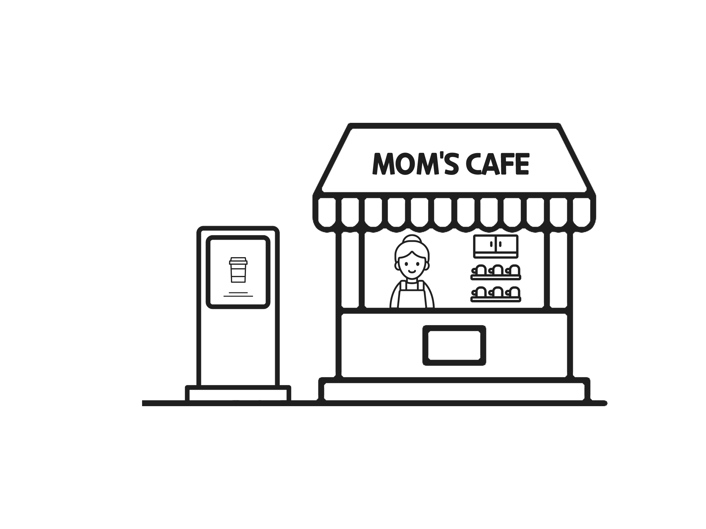

Project MCK
============
</img> 

### What is MCK?
- 한동대학교 맘스카페용 키오스크 프로그램을 구현하는 프로젝트로, 매니저용 모드와 클라이언트용 모드가 존재하여 선택 후 사용이 가능하다.

### Project Feature
- 두 가지 모드 선택
  - 매니저 모드
    - 카페 메뉴 관리 기능 (CRUD) + Load & Save
    - 매출 확인 기능
  - 클라이언트 모드
    - 장바구니 기능 (CRUD)
    - 결제 기능

### Development Environment & Programming Language
- C 

### Members
- 22000075 김민수 : 프로젝트 기획 및 매니저 모드 개발 
- 21901026 박주영 : 프로젝트 기획 및 클라이언트 모드 개발

